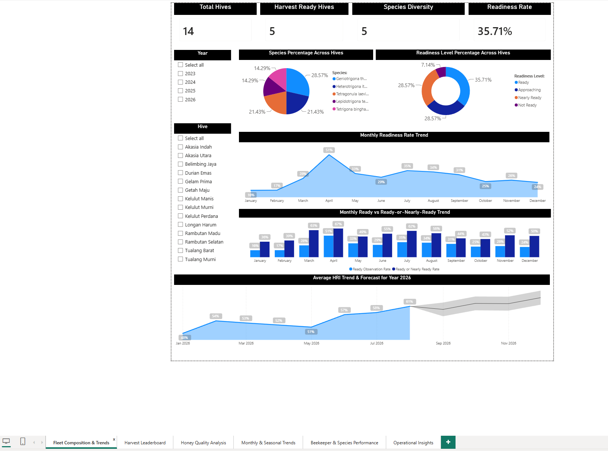
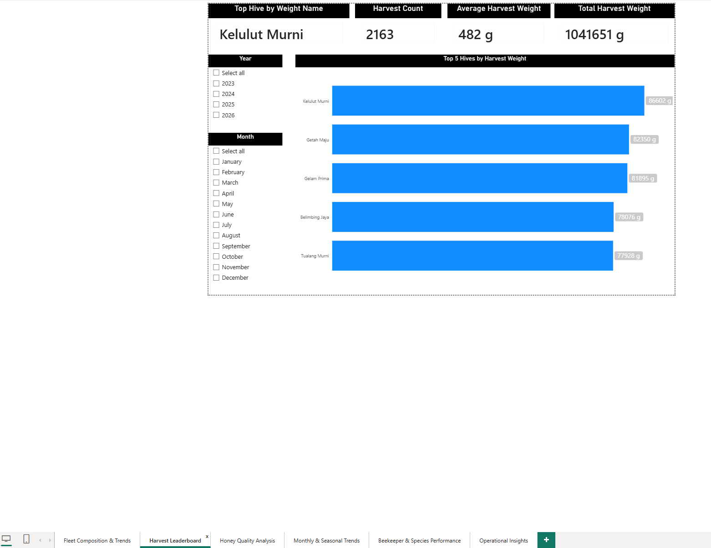
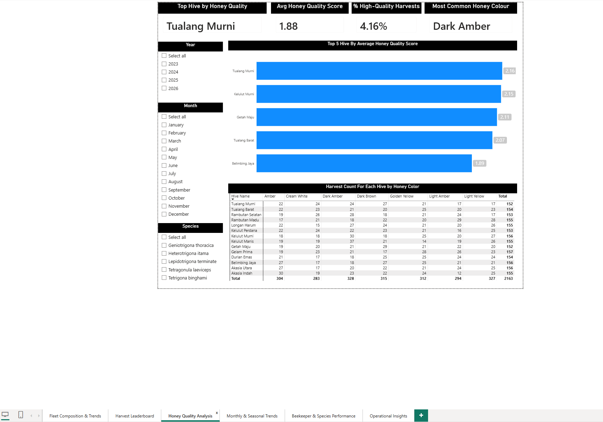
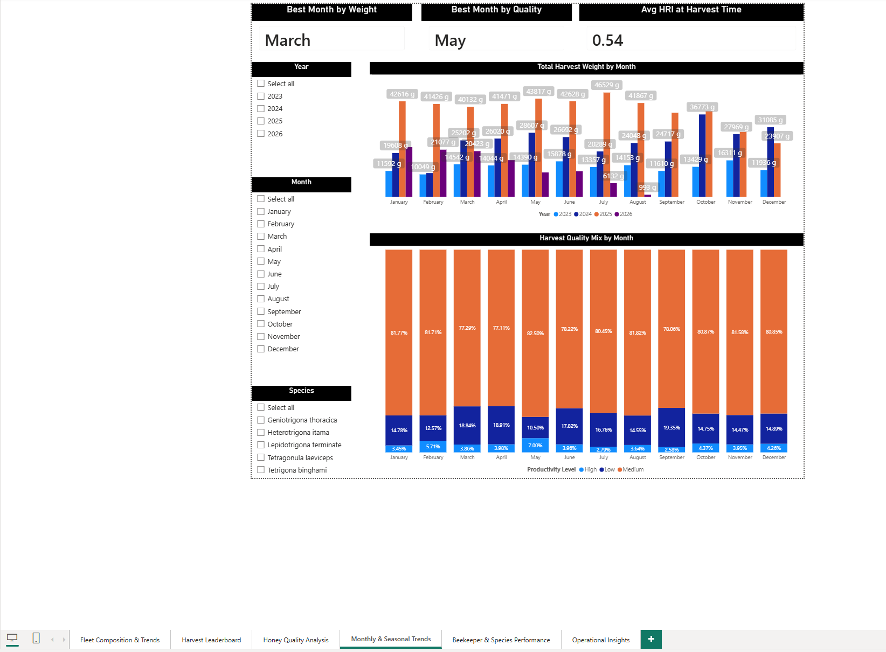
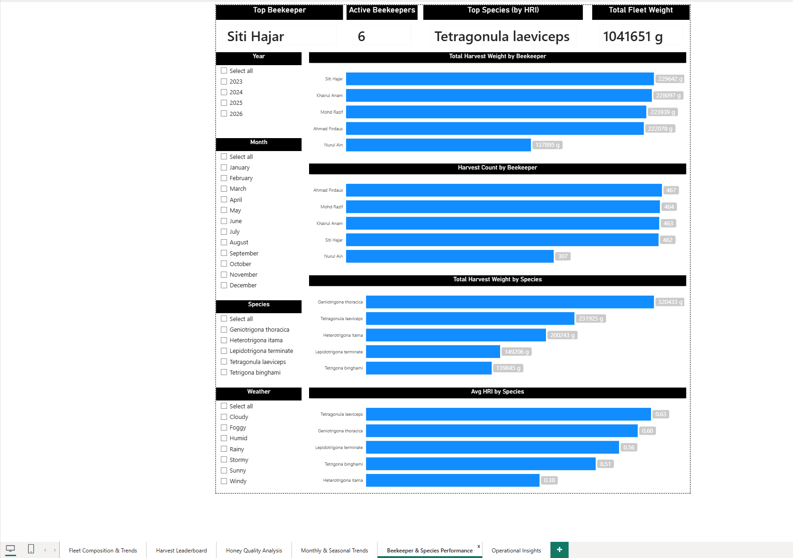
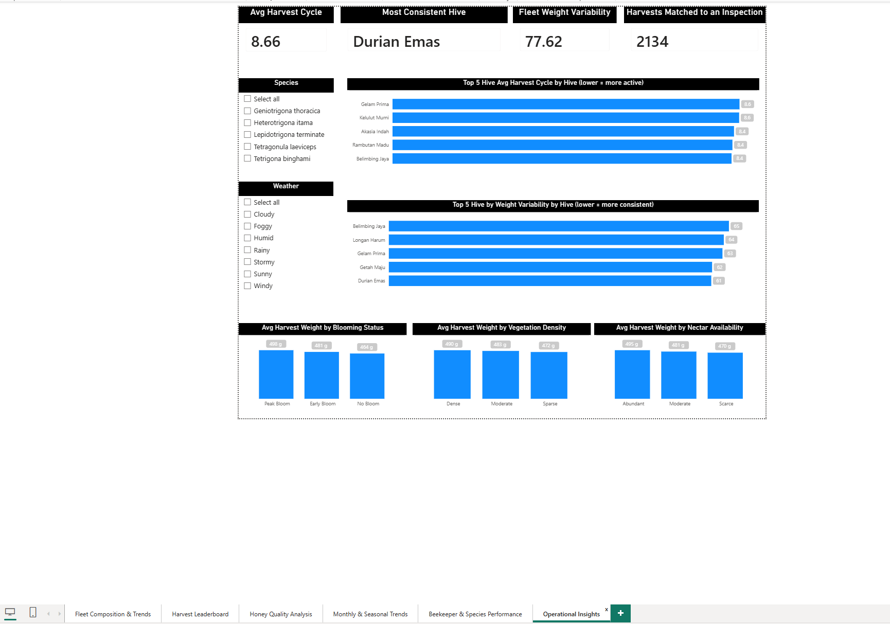

# BuzzyHive Power BI Dashboard — Reference & Storytelling Guide

Last updated: 2026-08-24.

**Single source of truth.** This replaces `HANDOFF.md`, `NEW_PAGES_PLAN.md`,
`CROSS_ANALYSIS_EXPANSION_PLAN.md`, and `DASHBOARD_STORYTELLING_GUIDE.md`
(all deleted). Those docs tracked an earlier, larger report shape — an
"Environmental Intelligence" page split into 5 pages, plus 4 further
cross-analysis pages — none of which was kept. The report was
consolidated down to **6 pages** on 2026-08-24; this doc describes only
what actually exists in the `.pbix` today.

Numbers quoted below (cards, chart values) are a snapshot from the
2026-08-24 screenshots used to write this doc — the database is live, so
treat them as a reference point, not a permanent truth. Re-run the
matching SQL against `buzzyhive2.0` before quoting a number in a
high-stakes context (a defense, a stakeholder report).

---

## 1. Report at a glance

- **Source**: MySQL `buzzyhive2.0`, live connection — refresh needed after
  any DML.
- **Table-name quirk**: MySQL tables import into Power BI as
  `'buzzyhive2 0 <table>'` (space-separated, not underscore) — confirmed
  for `harvests`, `hives`, `users`, `master_species`,
  `master_honey_colors`, `master_honey_flavors`, `inspections`. The
  `harvest_hri_link` **view** imports unprefixed, as `harvest_hri_link`.
  Always confirm against your own Data pane before pasting DAX from this
  doc — if a name differs there, that's the source of truth, not this
  file.
- **Card style convention**: every KPI card is a Card visual, black title
  bar (Format → General → Title **on**, Format → Header **off**), bold
  callout value.
- **Global date shift**: `harvests.harvest_date`, `inspections.
  inspection_date`, and `sensor_logs.record_timestamp` were all shifted
  back 2 years on 2026-08-20 so the dataset ends at "now" with no
  future-dated rows (now spans 2023-01-07 → 2026-08-27). `DateTable`
  spans `CALENDAR(DATE(2023,1,1), DATE(2026,12,31))`, with `MonthName`
  sort-by-`MonthNumber` so month axes render Jan→Dec.

### The 6 pages, in tab order

| # | Page | Answers |
|---|---|---|
| 1 | Fleet Composition & Trends | What does the fleet look like right now, and how has readiness/HRI moved over the year? |
| 2 | Harvest Leaderboard | Which hive produces the most? |
| 3 | Honey Quality Analysis | Which hive produces the best quality? |
| 4 | Monthly & Seasonal Trends | Does either of the above vary by season? |
| 5 | Beekeeper & Species Performance | Who's harvesting it, and does species matter? |
| 6 | Operational Insights | Which hives are reliable/consistent, and do pre-harvest conditions predict yield? |

---

## 2. Shared model pieces powering these 6 pages

- `harvests` — `hive_id`, `beekeeper_id`, `harvest_date`, `weight`,
  `color_id`, `flavor_id`, `productivity_level` (Low/Medium/High).
- `hives` → `master_species[id]` (species per hive) and →
  `master_sites` (not used on any kept page).
- `users` — imported with **only** `id`, `name`, `status` kept (password/
  2FA/token columns dropped in Power Query — don't re-add them). Filtered
  to beekeepers via a Power Query join against this app's Spatie-style
  `roles` + `model_has_roles` tables (there is no plain `users.role`
  column, despite what an older migration file might suggest).
  `harvests[beekeeper_id] → users[id]`, Many→1, Single.
- `harvest_hri_link` (MySQL view) — matches each harvest to its nearest
  pre-harvest inspection/HRI reading. Two relationships exist off it:
  - `harvest_hri_link[matched_inspection_id] → inspections[id]` —
    **active**, set to **Both** cross-filter.
  - `harvest_hri_link[hive_id] → hives[id]` — **inactive** (added later;
    kept inactive on purpose so it doesn't disturb the first
    relationship). Species-by-HRI measures activate it explicitly with
    `USERELATIONSHIP()`. If you ever touch either relationship, re-verify
    both paths still resolve correctly — Power BI will silently pick one
    of two paths to `hives` if both are ever left active at once.
  - `harvest_hri_link[harvest_date] → DateTable[Date]` — Many→1, Single
    (separate fact table on the same `DateTable`, normal star-schema
    shape).
- `DateTable[MonthName]` / `[Year]` — used for every seasonal chart.

### Known unresolved issue

`Active Beekeeper Count` (Beekeeper & Species Performance page) reads
**6**, not 5 — an Admin account is getting back into the filtered `users`
table, likely a Power Query step not persisting through refresh. Doesn't
affect any `harvests`-based chart (Admin has zero harvests, contributes
nothing), but the card itself is wrong. Not yet fixed — check Data view
for an "Admin" row and confirm the role filter step is still in Applied
Steps if you pick this up.

---

## 3. Page 1 — Fleet Composition & Trends



**Purpose**: fleet-wide composition (species mix, readiness mix) plus how
readiness and HRI have moved across the year — the "where do we stand,
and what's the shape of the trend" page.

**Slicers**: Year, Hive.

**Cards** (4): Total Hives, Harvest Ready Hives, Species Diversity,
Readiness Rate.

**Charts** (5): Species Percentage Across Hives (pie), Readiness Level
Percentage Across Hives (donut), Monthly Readiness Rate Trend (line),
Monthly Ready vs Ready-or-Nearly-Ready Trend (clustered bar, two series),
Average HRI Trend & Forecast for Year 2026 (line, with Analytics-pane
forecast band).

> **Note on this page's build history**: unlike the other 5 pages, this
> one predates the planning docs that used to live in this folder — no
> DAX/build-steps record exists for it. The underlying measures aren't
> documented here; if you need the exact DAX, open the page in Power BI
> and check each visual's field well directly rather than assuming
> anything below is derived from a written spec.

**Snapshot as of 2026-08-24** (14 hives, unfiltered):
- Total Hives 14 · Harvest Ready Hives 5 · Species Diversity 5 ·
  Readiness Rate 35.71%.
- Species mix: Geniotrigona thoracica 4 hives (28.57%), Heterotrigona
  itama 3 (21.43%), Tetragonula laeviceps 3 (21.43%), Lepidotrigona
  terminate 2 (14.29%), Tetrigona binghami 2 (14.29%).
- Readiness mix: Ready 5 (35.71%), Approaching 4 (28.57%), Nearly Ready 4
  (28.57%), Not Ready 1 (7.14%).
- Monthly Readiness Rate Trend: climbs from 16% (Jan) to a 51% peak in
  April, then drifts back down to the low-to-mid 20s-30s for the rest of
  the year (May 33%, Jun 29%, Jul 35%, Aug 34%, Sep 31%, Oct 25%, Nov
  26%, Dec 24%).
- Average HRI Trend & Forecast: starts 48% (Jan 2026), climbs fairly
  steadily to 61% by July 2026, then the Analytics-pane forecast band
  takes over (widening confidence interval into Aug–Nov 2026).

### Presentation script

**Act 1 — "Where do we stand?"**
> "We're tracking the full active fleet — 14 kelulut colonies, 5 species.
> Right now 35.71% of hives are classified Ready for harvest — the rest
> are Approaching or Nearly Ready (28.57% each) or resting after a recent
> harvest (7.14% Not Ready)."

Ground the species number in the biology if the audience isn't
apiculture-familiar: these are all generalist foragers, so flora variety
around a mix of 5 species matters more than it would for a single-crop
honeybee operation.

**Act 2 — "Has it always looked like this?"**
> "Readiness isn't flat across the year — it peaked at 51% in April and
> has drifted down to the low-to-mid 20-30% range since. That's not
> noise, that's a seasonal shape worth planning around, not a one-off dip
> to investigate."

Demo the slicers here: switch the Year filter and watch both trend
charts move — that's the moment that proves this is a live query, not a
static image.

**Act 3 — "Where is it headed?"**
> "HRI has been climbing steadily through the year, from 48% in January
> to 61% by July. The dashed line and shaded band past July are Power
> BI's own forecast — an indicative planning outlook, not a guarantee,
> and the band widens the further out it projects. That's the model
> being honest about its own uncertainty, not a hedge."

**Closing line**: *"So: a fleet that's currently just over a third
Ready, with a readiness trend that peaks mid-year, and an HRI trajectory
climbing into a cautiously optimistic forecast. That's the entry point —
everything else in this report answers a more specific follow-up
question this page raises."*

---

## 4. Page 2 — Harvest Leaderboard



**Purpose**: which hive produces the most, by weight and by count.

**Slicers**: Year, Month only (deliberate — Site/Species/Hive all cascade
correctly to `harvests`, but a Readiness slicer would filter nothing on
this page since `predictions → sensor_logs → hives` is Single-direction
cross-filter the wrong way; a minimal panel was chosen for this
specific page).

**Measures**:
```dax
Total Harvest Weight = SUM('buzzyhive2 0 harvests'[weight])
Harvest Count = COUNTROWS('buzzyhive2 0 harvests')

Top Hive by Weight Name =
VAR t = ADDCOLUMNS(VALUES('buzzyhive2 0 hives'[name]), "W", CALCULATE([Total Harvest Weight]))
VAR maxW = MAXX(t, [W])
RETURN MAXX(FILTER(t, [W] = maxW), 'buzzyhive2 0 hives'[name])

Top Hive by Weight Value =
VAR t = ADDCOLUMNS(VALUES('buzzyhive2 0 hives'[name]), "W", CALCULATE([Total Harvest Weight]))
RETURN MAXX(t, [W])
```
`Average Harvest Weight` is reused from elsewhere in the model.

**Cards** (4): Top Hive by Weight Name (+ Value), Total Harvest Weight,
Harvest Count, Average Harvest Weight.

**Chart** (1): Top 5 Hives by Harvest Weight — horizontal bar, sorted
descending. **Deliberately capped at Top 5, not all 14** — the visual's
item-limit setting defaulted to 5 and the user kept it that way
(punchier for a leaderboard). If you ever need a full 14-hive ranking,
check this setting first.

**Snapshot as of 2026-08-24**: Kelulut Murni leads at 86,602 g, Getah
Maju 82,350 g, Gelam Prima 81,895 g, Belimbing Jaya 78,076 g, Tualang
Murni 77,928 g. Total fleet weight 1,041,651 g across 2,163 harvests,
482 g average.

### Presentation script

> "Across the whole fleet we've recorded 2,163 harvests totaling just
> over one tonne — 1,041,651 grams — averaging 482 grams per harvest. The
> single biggest producer is Kelulut Murni, at roughly 87 kilograms
> total."

> "But it's not a one-hive story — the next four hives on the board
> (Getah Maju, Gelam Prima, Belimbing Jaya, Tualang Murni) all sit within
> about 10% of the leader. This is a competitive top tier, not one
> outlier hive carrying the fleet."

Note for whoever presents: the chart is intentionally capped at Top 5 —
say so if asked, framed as a leaderboard-style choice, not a data
limitation.

**Transition into Quality**: *"That's the most productive hive by
weight — but volume isn't the same thing as quality. Does the biggest
producer also make the best honey?"*

---

## 5. Page 3 — Honey Quality Analysis



**Purpose**: which hive produces the best quality, and what does typical
quality look like fleet-wide.

**Slicers**: Year, Month, Species.

**Measures**:
```dax
/* calculated column on harvests */
Quality Points = SWITCH('buzzyhive2 0 harvests'[productivity_level], "Low", 1, "Medium", 2, "High", 3, BLANK())

Avg Quality Score = AVERAGE('buzzyhive2 0 harvests'[Quality Points])

Pct High Quality =
DIVIDE(
    CALCULATE(COUNTROWS('buzzyhive2 0 harvests'), 'buzzyhive2 0 harvests'[productivity_level] = "High"),
    COUNTROWS('buzzyhive2 0 harvests')
)

Top Quality Hive Name =
VAR t = ADDCOLUMNS(VALUES('buzzyhive2 0 hives'[name]), "Q", CALCULATE([Avg Quality Score]))
VAR maxQ = MAXX(t, [Q])
RETURN MAXX(FILTER(t, [Q] = maxQ), 'buzzyhive2 0 hives'[name])
```
`Dominant Honey Colour` / `Dominant Honey Flavour` are reused from
elsewhere in the model.

**Cards** (4): Top Hive by Honey Quality (+ score), Avg Honey Quality
Score, % High-Quality Harvests, Most Common Honey Colour.

**Charts** (2, of 3 originally planned — see below): Top 5 Hive by
Average Honey Quality Score (bar, descending); Harvest Count for Each
Hive by Honey Colour (matrix, hive × colour).

**Deliberately not built**: a Low/Medium/High stacked-mix bar chart (the
ranking bar + cards already told the "quality skews Medium" story
clearly enough) and a flavour-by-hive matrix (canvas was full; a quick
add later if ever needed — same recipe as the colour matrix, swap
`master_honey_flavors[name]` in).

**Snapshot as of 2026-08-24**: Top hive Tualang Murni at 2.16 (Top 5:
Tualang Murni 2.16, Kelulut Murni 2.15, Getah Maju 2.11, Tualang Barat
2.07, Belimbing Jaya 1.89). Fleet Avg Quality Score 1.88/3. % High-Quality
Harvests 4.16%. Most Common Honey Colour: Dark Amber. Colour spread
across all 7 recorded colours is fairly even (283–328 harvests each).

### Presentation script

> "We score every harvest Low, Medium, or High and turn that into a
> weighted quality score out of 3. Fleet-wide, we're averaging 1.88 —
> closer to Medium than High — and only 4.16% of all harvests are rated
> High at all. That's a real, verified number, not a data gap: every one
> of the 2,163 harvests has a rating, none are blank."

> "The top hive by quality is Tualang Murni — but notice that's a
> *different* hive from Kelulut Murni, our weight leader from the last
> page. The biggest producer isn't the best-quality producer. And even
> Tualang Murni, our best, only scores 2.16 — just barely above the
> fleet's Medium midpoint of 2.0."

Present this as an honest, slightly humbling finding, not a problem to
explain away: most of this operation's honey is Medium grade, with High
being genuinely rare rather than typical.

**Transition into Monthly Trends**: *"So quality and quantity are two
different stories, and neither one is fixed — do either of them change
across the season?"*

---

## 6. Page 4 — Monthly & Seasonal Trends



**Purpose**: does harvest volume or quality vary by month/season.

**Slicers**: Year, Month, Species.

**Measures**:
```dax
Best Month by Weight Name =
VAR t = ADDCOLUMNS(VALUES(DateTable[MonthName]), "W", CALCULATE([Total Harvest Weight]))
VAR maxW = MAXX(t, [W])
RETURN MAXX(FILTER(t, [W] = maxW), DateTable[MonthName])

Best Month by Quality Name =
VAR t = ADDCOLUMNS(VALUES(DateTable[MonthName]), "Q", CALCULATE([Avg Quality Score]))
VAR maxQ = MAXX(t, [Q])
RETURN MAXX(FILTER(t, [Q] = maxQ), DateTable[MonthName])

Avg HRI (Harvest-Linked) = AVERAGE(harvest_hri_link[hri_value])
```
Card is titled "Avg HRI at Harvest Time (0–1 scale)" — kept on the raw
0–1 scale by deliberate choice rather than the report's usual ×100
percentage convention, to avoid ambiguity.

**Cards** (3): Best Month by Weight, Best Month by Quality, Avg HRI at
Harvest Time.

**Charts** (2): Total Harvest Weight by Month (clustered column, Year
legend, true calendar-month YoY comparison); Harvest Quality Mix by
Month (100% stacked column, `productivity_level` legend).

**Snapshot as of 2026-08-24**: Best Month by Weight = March, Best Month
by Quality = May, Avg HRI at Harvest Time = 0.54. Quality mix stays in a
tight 77–82% Medium band all year; High share ranges roughly 2.6–7.0%
across months, never zero, peaking in May.

> **Build note worth keeping**: an early render of the quality-mix chart
> looked like `High` was missing in 11 of 12 months — a genuine data
> artifact, right? Querying raw SQL directly (this project's standing
> practice: verify before calibrating) showed `High` present every
> month, 2.58–7.00%. The chart's data-label renderer was silently
> suppressing labels on thin segments — a formatting issue, not a data
> issue. Worth remembering as a general lesson: a suspicious pattern in a
> Power BI visual isn't automatically a database problem.

### Presentation script

> "By weight, March is our strongest month at just over 100 kilograms
> fleet-wide, with April and May close behind — a real mid-year peak, not
> a flat line. By quality, May edges out as the best month for
> High-rated harvests, at 7%, against a typical month of around 4%."

> "Quality mix, though, barely moves month to month — Medium sits in a
> tight 77–82% band all year. So there's a real, moderate seasonal signal
> in *how much* we harvest, but not much of one in *how good* it is —
> quality looks more like a fleet-wide characteristic than a seasonal
> one."

> "The average HRI reading at the moment of harvest is 0.54 on our
> 0-to-1 readiness scale — meaning the typical harvest happens at just
> over half of full model-assessed readiness, not right at the peak."

**Closing line for this module**: *"Put together: one hive leads on
volume, a different hive leads on quality, harvest volume has a real
seasonal rhythm peaking in spring, and quality stays remarkably
consistent regardless of season. That's four separate, specific
answers — not just 'the farm is doing fine.'"*

---

## 7. Page 5 — Beekeeper & Species Performance



**Purpose**: per-person and per-species performance — a gap the live app
has no analytics for at all.

**Slicers**: Year, Month, Species, Weather.

**Measures**:
```dax
Top Beekeeper Name =
VAR t = ADDCOLUMNS(VALUES('buzzyhive2 0 users'[name]), "W", CALCULATE([Total Harvest Weight]))
VAR maxW = MAXX(t, [W])
RETURN MAXX(FILTER(t, [W] = maxW), 'buzzyhive2 0 users'[name])

Top Species by HRI Name =
VAR t = ADDCOLUMNS(VALUES('buzzyhive2 0 master_species'[name]), "H", CALCULATE(AVERAGE(harvest_hri_link[hri_value])))
VAR maxH = MAXX(t, [H])
RETURN MAXX(FILTER(t, [H] = maxH), 'buzzyhive2 0 master_species'[name])
/* reads harvest_hri_link -> hives via USERELATIONSHIP, see Section 2 */

Active Beekeeper Count = CALCULATE(DISTINCTCOUNT('buzzyhive2 0 users'[id]), 'buzzyhive2 0 users'[status] = "active")
```

**Cards** (4): Top Beekeeper, Active Beekeepers (reads 6, known bug — see
Section 2), Top Species (by HRI), Total Fleet Weight.

**Charts** (4): Total Harvest Weight by Beekeeper (bar, descending);
Harvest Count by Beekeeper (bar, descending); Total Harvest Weight by
Species (bar, descending); Avg HRI by Species (bar, descending).

**Snapshot as of 2026-08-24**:
- By weight: Siti Hajar 229,642 g, Khairul Anam 228,097 g, Mohd Razif
  223,939 g, Ahmad Firdaus 222,078 g, Nurul Ain 137,895 g.
- By count: Ahmad Firdaus 467, Mohd Razif 464, Khairul Anam 463, Siti
  Hajar 462, Nurul Ain 307.
- By species weight: Geniotrigona thoracica 320,433 g, Tetragonula
  laeviceps 231,925 g, Heterotrigona itama 200,243 g, Lepidotrigona
  terminate 149,206 g, Tetrigona binghami 139,845 g.
- Avg HRI by species: Tetragonula laeviceps 0.63, Geniotrigona thoracica
  0.60, Lepidotrigona terminate 0.56, Tetrigona binghami 0.51,
  Heterotrigona itama 0.38.

**Real finding worth keeping**: Siti Hajar is Top Beekeeper by weight
despite having *fewer* harvests (462) than Ahmad Firdaus (467) — her
average harvest is simply bigger, not more frequent. Nurul Ain has
noticeably fewer harvests (307 vs 460+ for the other four) and
proportionally lower weight — reads as fewer assigned hives, not lower
per-harvest productivity, since the ratio holds.

### Presentation script

> "Five active beekeepers manage this fleet. Siti Hajar leads by total
> weight at just under 230 kilograms — but notice she doesn't have the
> most harvests. Ahmad Firdaus has more harvests (467 vs 462) but less
> total weight. Same effort, different outcome — Siti Hajar's average
> harvest just runs bigger."

> "Nurul Ain sits well below the other four on both weight and count —
> about two-thirds their harvest count. Before reading that as lower
> productivity, check the ratio: her weight-per-harvest is in line with
> everyone else's, so this reads as fewer hives assigned, not a
> performance gap."

> "By species, Tetragonula laeviceps both produces well by weight and
> leads on Average HRI — the two numbers agree, which is a stronger
> claim than either alone: it's not just a heavy producer, it's a
> genuinely healthier-reading colony type. Heterotrigona itama sits
> lowest on HRI (0.38) despite a respectable weight total — worth
> flagging as a species where volume and readiness diverge."

**Framing note for whoever presents this page**: this data invites a
"who's the best beekeeper" narrative — resist it. The honest read is
"here's the ranking, and here's the context (harvest count, hive
assignment) that explains most of the gap" rather than a performance
verdict. See Page 6 (Operational Insights) for the environmental-
confound angle this page doesn't control for.

---

## 8. Page 6 — Operational Insights



**Purpose**: which hives are dependable vs. volatile (harvest-cycle
reliability, weight consistency), and whether pre-harvest inspection
conditions predict yield.

**Slicers**: Species, Weather (as visible in the current build).

**Measures/columns**:
```dax
/* calculated column on harvests */
Previous Harvest Date =
VAR CurrentHive = 'buzzyhive2 0 harvests'[hive_id]
VAR CurrentDate = 'buzzyhive2 0 harvests'[harvest_date]
RETURN
CALCULATE(
    MAX('buzzyhive2 0 harvests'[harvest_date]),
    FILTER(
        ALL('buzzyhive2 0 harvests'),
        'buzzyhive2 0 harvests'[hive_id] = CurrentHive &&
        'buzzyhive2 0 harvests'[harvest_date] < CurrentDate
    )
)

/* calculated column, depends on the one above */
Days Since Previous Harvest =
IF(
    ISBLANK('buzzyhive2 0 harvests'[Previous Harvest Date]),
    BLANK(),
    DATEDIFF('buzzyhive2 0 harvests'[Previous Harvest Date], 'buzzyhive2 0 harvests'[harvest_date], DAY)
)

Avg Harvest Cycle Days = AVERAGE('buzzyhive2 0 harvests'[Days Since Previous Harvest])
Weight Std Dev = STDEV.P('buzzyhive2 0 harvests'[weight])

Most Consistent Hive Name =
VAR t = ADDCOLUMNS(VALUES('buzzyhive2 0 hives'[name]), "SD", CALCULATE([Weight Std Dev]))
VAR minSD = MINX(t, [SD])
RETURN MAXX(FILTER(t, [SD] = minSD), 'buzzyhive2 0 hives'[name])
```
A hive's first-ever harvest legitimately has no prior harvest —
`Previous Harvest Date`/`Days Since Previous Harvest` are blank for one
row per hive; `AVERAGE` skips blanks automatically.

**Cards** (4): Avg Harvest Cycle, Most Consistent Hive, Fleet Weight
Variability, Harvests Matched to an Inspection.

**Charts** (5): Top 5 Hive Avg Harvest Cycle by Hive (ascending — lower
= more active); Top 5 Hive by Weight Variability by Hive (ascending —
lower = more consistent); Avg Harvest Weight by Blooming Status; Avg
Harvest Weight by Vegetation Density; Avg Harvest Weight by Nectar
Availability (all three small columns, sorted worst→best).

Both leaderboard-style charts sort **ascending** — the opposite of every
other ranking chart in this report — because lower is better for both
metrics (cycle days, weight variability). This was caught as a real bug
during build: the item-limit initially defaulted to *highest* 5, which
made it look like `Most Consistent Hive` didn't belong in a "Top 5 most
consistent" chart. Call the direction out in a live demo so it doesn't
read backwards.

**Snapshot as of 2026-08-24**:
- Avg Harvest Cycle 8.66 days · Most Consistent Hive Durian Emas ·
  Fleet Weight Variability 77.62 · Harvests Matched to an Inspection
  2,134.
- Fastest cycles (~8.4–8.6 days): Gelam Prima, Kelulut Murni, Akasia
  Indah, Rambutan Madu, Belimbing Jaya.
- Most consistent by weight SD: Durian Emas 61, Getah Maju 62, Gelam
  Prima 63, Longan Harum 64, Belimbing Jaya 65.
- Avg Harvest Weight by Blooming Status: Peak Bloom 498 g, Early Bloom
  481 g, No Bloom 464 g.
- by Vegetation Density: Dense 490 g, Moderate 483 g, Sparse 472 g.
- by Nectar Availability: Abundant 495 g, Moderate 481 g, Scarce 470 g.

**Background this page's numbers depend on**: `harvests.weight` was
deliberately calibrated against blooming status, vegetation density,
nectar availability, and weather on 2026-08-20 (the 3 built condition
charts came back flat before this change) — a real, verified database
change. One consequence: `Most Consistent Hive` flipped from Getah Maju
to Durian Emas as a direct result, re-verified against fresh SQL as
correct, not a regression. A 4th chart (Avg Harvest Weight by Weather)
was deliberately not built even though the Weather slicer and underlying
data support one — a quick add later if wanted (same recipe, axis
`master_weather_conditions[name]`).

### Presentation script

> "The average hive gets harvested roughly every 8.7 days. Our most
> consistent hive by yield is Durian Emas — its harvest weight varies
> the least of any hive in the fleet, standard deviation 61 grams
> against a fleet-wide 77.6."

> "We matched 2,134 of 2,163 harvests to a pre-harvest inspection —
> essentially full coverage. That lets us ask: does the condition an
> inspector recorded right before a harvest actually predict a bigger or
> smaller one? Peak Bloom harvests average 498 grams versus 464 for No
> Bloom — a real but modest gap, and the same direction shows up for
> vegetation density and nectar availability too. Smaller effect than
> you'd see comparing hives to each other, but a consistent one: more
> forage at harvest time, somewhat bigger harvests."

**Framing note**: this page is the natural place to revisit Page 5's
beekeeper ranking with a skeptical eye — if a beekeeper's hives happen to
sit at sites with consistently better bloom/vegetation/nectar
conditions, some of their apparent edge could be environmental rather
than skill. Neither page currently cross-references the other's finding
directly; that's a fair question to raise live rather than a gap to
apologize for.

---

## 9. Reading the dashboard for insight (not just reacting to problems)

**Reactive reading** starts from a problem: "Ready Observation Rate
dropped, why?" Legitimate, but narrow — it only fires when something
already looks broken.

**Insight reading** starts from the dashboard and asks what it's telling
you regardless of whether anything looks wrong. Ask these four questions
of every card and chart, whether or not it's flagged as a problem:

1. **Trend** — is this number moving over time, or is "now" the only
   thing being looked at?
2. **Compare** — moving relative to what? A number means little alone;
   it means something next to another hive, another beekeeper, another
   species, or the same period last year.
3. **Explain** — is there a plausible mechanism connecting this number to
   another one on the dashboard?
4. **Act** — if this pattern holds up, what would a beekeeper or farm
   manager actually do differently? If the honest answer is "nothing,"
   it's probably not insight yet.

A pattern only counts as insight once it clears **Trend + Compare**, and
only counts as *useful* insight once it also clears **Act**.

### Worked examples, using this report

| Reactive read | Insight read |
|---|---|
| "Readiness Rate is 35.71%, seems mediocre." | Filter Fleet Composition & Trends' Monthly Readiness Rate Trend across the year. It peaks in April (51%) and drifts down afterward — a seasonal shape, not a flat mediocre number, and worth planning harvest scheduling around. |
| "Harvests Matched to an Inspection is only 2,134 of 2,163, why not all?" | Break the gap down by hive/beekeeper before assuming it's a data problem — a small, consistent shortfall across every hive reads differently than a shortfall concentrated on one beekeeper's hives (a process gap, not a modeling one). |
| "Siti Hajar is the Top Beekeeper, she's doing the best." | Compare her harvest count to her weight total (Page 5). She has *fewer* harvests than the count leader — her edge is bigger individual harvests, not more frequent ones. That's a different, more specific claim than "best beekeeper." |
| "Avg Quality Score is 1.88, seems fine." | Compare it to the Top Hive's score (2.16, Page 3) — even the *best* hive barely clears the fleet's Medium midpoint (2.0). That's a fleet-wide characteristic worth naming explicitly, not a "some hives underperform" story. |

---

## 10. Suggested filter sequence for a live demo

1. **Start broad** — all years, all months selected (Select all). State
   the whole-fleet numbers.
2. **Narrow to one recent month** — show the cards move. This is the
   moment that proves it's a real filtered query, not a static image.
3. **Narrow further to one Hive or Beekeeper** (whichever page supports
   it) — walk through what the numbers look like for a single entity.
4. **Reset filters** before moving to the next page, so you're not
   accidentally presenting a filtered view of the next page's visuals
   without realizing it.

---

## 11. Do's and don'ts

**Do:**
- Say *why* a number is what it is, not just what it is.
- Let the filter panel do work during the demo — a moving number is more
  convincing than a static one.
- Own the imperfect numbers (4.16% High-quality, an 8-percentage-point
  quality-mix range across months) as evidence of realistic modeling,
  not gaps to gloss over.

**Don't:**
- Don't read every card in on-screen order — group by what question each
  one answers (see each page's presentation script above).
- Don't turn Page 5's beekeeper ranking into a performance verdict — pair
  it with the context (harvest count, hive assignment, Page 6's
  environmental angle) every time it's shown.
- Don't leave a stray diagnostic/test visual on a page during a real
  presentation — check the canvas before presenting.

---

## 12. One-paragraph version (if you only have 30 seconds)

> "We're tracking 14 kelulut hives across 5 species. Right now 35.71% are
> Ready for harvest, and that rate has followed a real seasonal
> shape — peaking mid-year. Across 2,163 recorded harvests totaling just
> over a tonne, one hive leads on volume (Kelulut Murni) and a different
> one leads on quality (Tualang Murni) — but fleet-wide honey quality
> skews Medium, not High, with only 4.16% rated High. Harvest volume has
> a real seasonal peak in March; quality stays flat regardless of season.
> Our most consistent hive by yield is Durian Emas, and pre-harvest bloom
> and forage conditions do predict somewhat bigger harvests — a modest
> but real, verified effect."
